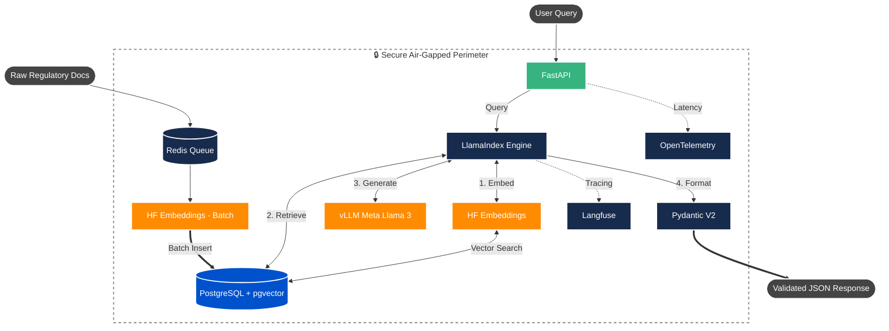

# 🛡️ Sovereign RAG Benchmark

An open-source, fully air-gapped Retrieval-Augmented Generation (RAG) architecture designed for highly regulated environments (Aerospace, Defense, Healthcare). 

This repository serves as a benchmark for building enterprise-grade Document Intelligence over complex regulatory directives and engineering specifications **without relying on managed public APIs** (like OpenAI or Anthropic). It demonstrates how to orchestrate local LLM inference, hybrid vector retrieval, and deterministic citation tracking entirely within a secure perimeter, guaranteeing zero data leakage and zero vendor lock-in.

## 📊 Enterprise Impact & Benchmark Results

In production environments mirroring this architecture, the system achieved:

- **Query Resolution Time:** Reduced compliance analyst lookup times from **~45 minutes to under 3 minutes**.
- **Retrieval Precision:** Improved precision on domain-specific regulatory queries by **43%** using strict metadata pre-filtering.
- **Latency:** Sustained **sub-200ms** retrieval latency across a corpus of 500,000+ indexed document chunks.
- **Ingestion Velocity:** Reduced full-corpus re-ingestion time from **6.2 hours to 1.4 hours** using Redis-backed asynchronous chunking queues.

## 🏗️ System Architecture




## 🛠️ The Tech Stack

- **AI & Orchestration (The Sovereign Core)**
  - **Meta Llama 3 (8B Instruct):** Served locally via **vLLM** for high-throughput, air-gapped inference.
  - **Hugging Face (`BAAI/bge-large-en-v1.5`):** Self-hosted, state-of-the-art local embedding model.
  - **LlamaIndex:** Core framework for data ingestion and Hybrid RAG pipeline orchestration.
- **Backend & Data Processing**
  - **Python 3.12:** Strictly typed (`mypy` enforced).
  - **FastAPI:** High-performance async API layer.
  - **PostgreSQL + `pgvector`:** Persistent vector storage and dense semantic search.
  - **Redis:** In-memory message broker for parallelizing asynchronous document chunking.
- **Validation & Observability**
  - **Pydantic V2:** Enforcing strict, deterministic JSON schemas to guarantee hallucination-free citation traceability.
  - **Langfuse & OpenTelemetry:** Distributed tracing and RAG retrieval quality monitoring.

## 📂 Project Structure

```text
sovereign-rag-benchmark/
├── docker-compose.yml          # Local infrastructure (pgvector, Redis, vLLM)
├── pyproject.toml              # Strict dependency management via `uv`
├── infrastructure/             # Cloud IaC (Azure Bicep for secure VPC deployment)
├── scripts/                    # Benchmarking and synthetic data generation
├── src/
│   ├── api/                    # FastAPI endpoints and OpenTelemetry instrumentation
│   ├── core/                   # Pydantic BaseSettings configuration
│   ├── engine/                 # LlamaIndex, Hugging Face, and pgvector orchestration
│   └── schemas/                # Strict Pydantic V2 traceability schemas
└── tests/                      # Pytest suite for API and schema validation
```

---

## 🚀 Getting Started (Local Benchmark)

### 1. Prerequisites & Environment

- **Hardware:** An NVIDIA GPU is recommended for vLLM inference.
- **Tokens:** You must accept Meta's Llama 3 license on Hugging Face and generate an access token.

Create a `.env` file in the root directory:

```env
HF_TOKEN=hf_your_huggingface_token_here
```

### 2. Stand Up Infrastructure

Boot the isolated PostgreSQL (`pgvector`), Redis queue, and local `vLLM` container.

```bash
docker compose up -d
```

### 3. Install Dependencies

This project uses `uv` for deterministic dependency resolution.

```bash
uv venv --python 3.12
source .venv/bin/activate  # Windows: .venv\Scripts\activate
uv pip install -e .
```

### 4. Code Quality & Testing (CI/CD Readiness)

This codebase adheres to strict enterprise hygiene. Before running, verify the types and unit tests:

```bash
# Run strict static type checking
uv run mypy src/ scripts/ tests/

# Run the API boundary test suite
uv run pytest
```

### 5. Generate & Ingest Data

Generate synthetic regulatory directives and asynchronously embed them into `pgvector`.

```bash
uv run python scripts/generate_sample_data.py
uv run python src/engine/ingest.py
```

### 6. Run the API & Benchmark

Start the FastAPI server:

```bash
uvicorn src.api.main:app --reload --port 8080
```

In a separate terminal, execute the automated benchmark load test to verify latency and citation traceability:

```bash
uv run python scripts/run_benchmark.py
```

## ☁️ Enterprise Deployment Topology

While this repository provides a local Dockerized benchmark, the architecture is designed for strictly controlled cloud perimeters. See `infrastructure/vllm-gpu-deployment.bicep` for a reference deployment mapping this system to **Azure Container Apps** operating entirely within an internal Virtual Network, secured by **Azure API Management** and **Azure Private Link** to ensure zero public internet routing.